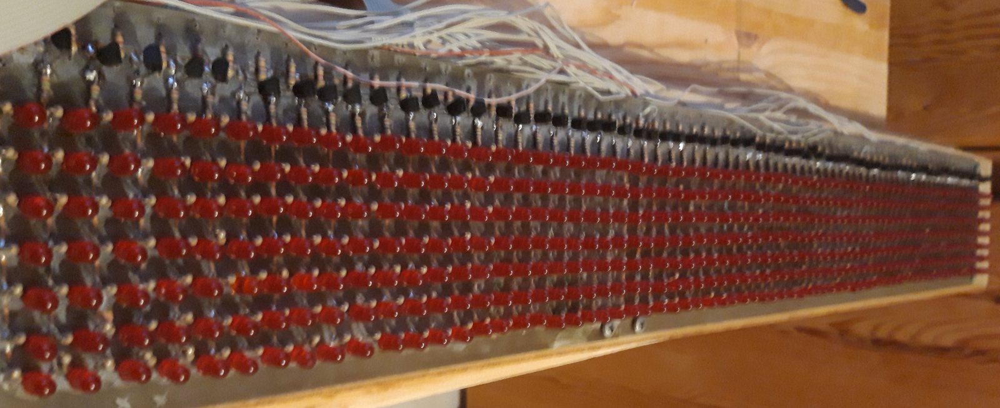
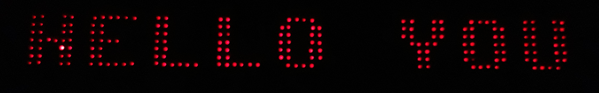

# Retro LED display
This project started in the mids of the 80th when a good friend of mine approached me, asking if we could build an LED display for his birthday party. So we did. Nobody believed us that we did it ourselves.

Technically, it was mounted on an old wooden panel, and  driven by a self-designed and build hardware extension for by my C64. the software written in 6502 (actually 6510) assembler, using the character set of the C64. It implemented a bunch of special effects as well, like blending randomly one text to another, scrolling in different directions etc.
Later, the hardware was reused for other projects but the display itself with its about 500 LEDs. The project died with my C64.

A couple of years ago I found it it back from my parents house, and recovered it. Only recently I made a first attempt to develop some new hardware and interface it with a RaspberryPi.

Maybe somebody might find it interesting. Here's an example of how it looks like:

## [Hardware](hardware/README.md)
The display consist of 504 red LEDs (state of the art mid 80th). The exact specifications of the LEDs got lost. It's organised in 3 blocks of 7 rows and 24 (or 3x8) columns each. More details can be found in the hardware folder.

## [Software](software/README.md)
The driver software is written in C using libgpiod. Check the [README](software/README.md) file in 
the software folder. For now, only text scroll-in is implemented. To ease up code development, a simulator has been added.

