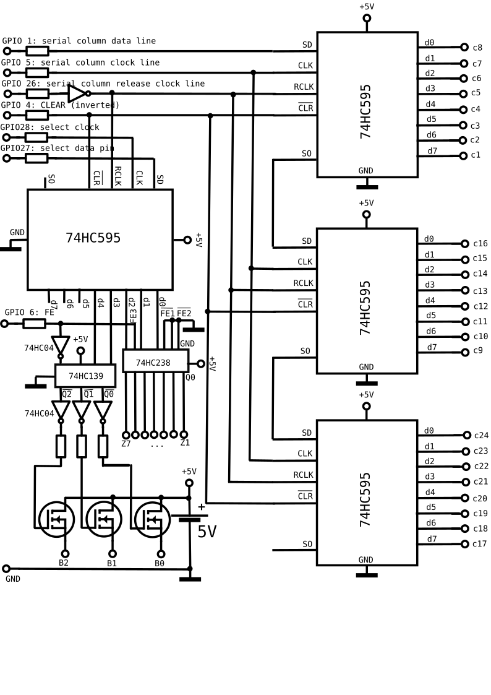

# Hardware
The hardware consists of the array itself and the electronics to interface it with a Raspberrypi.

## Disclaimer
The hardware described here is eventually sub-optimal and often based on what was available at the time when the array was created.

## Power
I use an external 5V power supply for the display and the electronics to avoid frying the Raspberrypi.

## LED array
The LED array is organised in 3 blocks of 24 columns, and has 7 rows in total.
It is made in a way that only 24 LED can be on at the same time in a single block, all of them being located in the same row. This limits power consumption. However, it also limits the light emitted by the array.

The electronics are made in such a way that only one block and one row is powered on at each point in time.

The array comes with 
* 3 pins VB1, VB2 and VB3: providing power for blocks B1, B2 and B3
* 24 pins selecting the column in the active block
* 7 pins selecting the current row
The way it is done, the 24 column pins are inverted, that is high level switched the column off rather than on.
The resistors R need to be dimensioned depending on Vcc, taking into account the E-C voltage loss at the transistors BC237 and BC337 and the LEDs themselves. Thus, it depends on the specifications of the LEDs used. 

Since the LEDs are used in a pulsed way, in the current setup R is underdimensioned, allowing to maximise the light emissions.

## Electronics for Raspberrypi

The interface is shown below:

The cabling for the 24 columns is straight forward, using 3 8 bit shift registers with latches (74HC595). Rows and block numbers are encoded using a second 74HC595, where the lower 3 bits (0, 1, 2) encode the row number as binary, and bit 3 and 4 encode the block number. These are converted into decimal using a 2 to 4 and a 3 to 8 converter, respectively.
This way by hardware it is ensured that only one row of 24 LEDs in a single block can be switched on.

